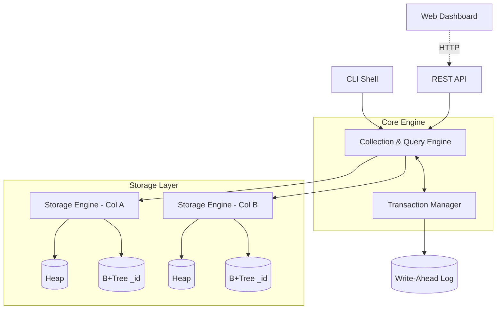

<div align="center">
  
  <h1>MiniDB</h1>
  <p><strong>A lightweight, purely Node.js document database built from scratch.</strong></p>

  [](https://nodejs.org/)
  [](https://opensource.org/licenses/MIT)
  []()
</div>

---

**MiniDB** is a fully functional document database built from scratch in Node.js. It acts as a small-scale MongoDB, utilizing entirely custom-built internal engines rather than wrapping around existing solutions like SQLite or LevelDB. The B+Tree index, page manager, write-ahead log (WAL), and transaction layer are all hand-written from the ground up.

---

## 📑 Table of Contents
- [✨ Key Features](#-key-features)
- [🚀 Getting Started](#-getting-started)
- [💻 Interfaces](#-interfaces)
  - [Interactive CLI Shell](#interactive-cli-shell)
  - [REST API](#rest-api)
  - [Web Dashboard](#web-dashboard)
- [🏗️ Architecture](#️-architecture)
- [🎓 Why this project?](#-why-this-project)
- [⚠️ Known Trade-offs](#️-known-trade-offs)

---

## ✨ Key Features
- 🌲 **On-disk B+Tree Index** — Real page-based storage, node splitting, and ordered range scans.
- 📜 **Write-Ahead Log (WAL)** — Mutations are fsync'd to a log *before* being applied, ensuring safe crash recovery.
- 🔒 **Transactions** — Full `BEGIN` / `COMMIT` / `ROLLBACK` functionality with read-your-own-writes isolation and crash atomicity.
- 🔍 **Rich Query Engine** — Supports MongoDB-style filters (`$gt`, `$in`, `$and`, `$regex`, etc.), sorting, projections, and automatic secondary index utilization.
- 🔌 **Multiple Interfaces** — Includes a REST API, a `mongosh`-style interactive shell, and a built-in web dashboard.

---

## 🚀 Getting Started

### Prerequisites
- [Node.js](https://nodejs.org/) (v14 or higher recommended)

### Installation
Clone the repository and install the dependencies:
```bash
git clone https://github.com/yourusername/minidb.git
cd minidb
npm install
```

### Running the Project

You can start MiniDB in various ways depending on your needs:

**1. Start the REST API & Web Dashboard**
```bash
npm start
```
*The web dashboard and API will be served on `http://localhost:4000`.*

**2. Start the Interactive CLI Shell**
```bash
npm run shell
```
*Launch a MongoDB-style REPL environment to interact with your data.*

**3. Run the Automated Test Suite**
```bash
npm test
```
*Tests the B-Tree correctness, CRUD operations, transactions, and crash recovery logic.*

---

## 💻 Interfaces

### Interactive CLI Shell
Start the shell with `npm run shell`. You can evaluate real JavaScript against a live database handle, just like `mongosh`.

```javascript
minidb> db.users.insertOne({ name: "Deepak", age: 21 })
minidb> db.users.createIndex("age")
minidb> db.users.find({ age: { $gt: 18 } })

// Transactions
minidb> const t = db.beginTransaction()
minidb> db.users.updateOne({ name: "Deepak" }, { $inc: { age: 1 } }, { txnId: t })
minidb> db.commitTransaction(t)
```

### REST API
Start the server with `npm start` and interact via standard HTTP requests.

**Insert a document:**
```bash
curl -X POST http://localhost:4000/api/users/insert \
  -H 'Content-Type: application/json' \
  -d '{"name":"Deepak", "age":21}'
```

**Find documents:**
```bash
curl -X POST http://localhost:4000/api/users/find \
  -H 'Content-Type: application/json' \
  -d '{"filter": {"age": {"$gt": 18}}}'
```

**Transactions via API:**
```bash
curl -X POST http://localhost:4000/api/tx/begin
curl -X POST http://localhost:4000/api/users/insert/tx/<txnId> -d '{"name":"TxnUser"}'
curl -X POST http://localhost:4000/api/tx/<txnId>/commit
```

### Web Dashboard
A lightweight GUI for visualizing your data, running queries, inserting documents, and managing indexes.
Simply run `npm start` and open **[http://localhost:4000](http://localhost:4000)** in your browser.

---

## 🏗️ Architecture

MiniDB is structured into clear layers, cleanly separating the storage engine, query logic, and user interfaces.



### Project Layout
- `src/storage/`: The low-level database engine (`Pager`, `Heap`, `BTree`, `WAL`, `StorageEngine`).
- `src/engine/`: The abstraction layer (`Database`, `Collection`, `TransactionManager`, `QueryEngine`).
- `src/api/`: Express REST server.
- `src/cli/`: Interactive Node `vm` shell.
- `web/public/`: HTML/CSS/JS dashboard (no build step required).
- `tests/`: Automated crash-recovery and correctness tests.

---

## 🎓 Why this project?
MiniDB is built as a highly technical demonstration of systems engineering fundamentals that typical CRUD applications abstract away:
- **Real Storage Mechanics:** It doesn't use `Array.filter()` in memory. It uses real on-disk node splitting and linked leaves.
- **Data Durability:** Every mutation is safely logged. Mid-transaction process kills are completely recoverable.
- **Transaction Isolation:** Read-your-own-writes isolation ensures you can preview your transaction before committing it.

---

## ⚠️ Known Trade-offs
To keep the codebase readable, educational, and easy to reason about line-by-line, the following deliberate scope cuts were made:
- **Single-Writer Transactions:** Provides atomicity and durability but relies on a single active transaction at a time instead of full MVCC concurrency.
- **Lazy Deletions:** Deletes remove the key but don't rebalance or merge underflowing B-Tree nodes.
- **No Heap Compaction:** Updates and deletes leave dead bytes in the heap file (similar to requiring a `VACUUM` in Postgres).
- **JSON-Serialized Pages:** Nodes are saved as padded JSON rather than packed binary. This limits the number of keys per 8KB page but maximizes readability.

---
<div align="center">
  <i>Built with ❤️ in Node.js</i>
</div>
